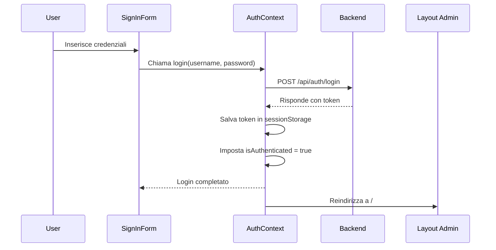

# Logica di Autenticazione del Client

## Componenti Principali

1. **AuthContext** (`src/context/AuthContext.tsx`)
   - Gestisce lo stato globale dell'autenticazione
   - Fornisce metodi per login/logout
   - Mantiene il token di autenticazione

2. **Layout Principale** (`src/app/layout.tsx`)
   - Wrapper di primo livello dell'applicazione
   - Inizializza i provider (AuthProvider, ThemeProvider, SidebarProvider)

3. **Layout Admin** (`src/app/(admin)/layout.tsx`)
   - Protegge le rotte amministrative
   - Verifica l'autenticazione dell'utente
   - Reindirizza a /signin se non autenticato

4. **SignInForm** (`src/components/auth/SignInForm.tsx`)
   - Form di login
   - Gestisce l'inserimento delle credenziali
   - Comunica con AuthContext per l'autenticazione

## Flusso di Autenticazione



## Stati di Autenticazione

L'autenticazione ha tre possibili stati:
- `null`: stato iniziale/sconosciuto (loading)
- `false`: utente non autenticato
- `true`: utente autenticato

## Protezione delle Rotte

1. Il Layout Admin verifica lo stato di autenticazione
2. Se `isAuthenticated === null || !isAuthenticated`:
   - Renderizza null (nessun contenuto)
   - Reindirizza a /signin
3. Se `isAuthenticated === true`:
   - Renderizza il contenuto protetto

## Gestione del Token

1. **Login**
   - Il token viene ricevuto dal backend
   - Viene salvato in sessionStorage
   - isAuthenticated viene impostato a true

2. **Verifica Automatica**
   - Al caricamento, AuthContext controlla sessionStorage
   - Se trova un token, imposta isAuthenticated = true
   - Altrimenti, imposta isAuthenticated = false

3. **Logout**
   - Rimuove il token da sessionStorage
   - Imposta isAuthenticated = null
   - Reindirizza a /signin

## Struttura delle Directory

```
src/
├── app/
│   ├── layout.tsx               # Layout principale con providers
│   └── (admin)/
│       └── layout.tsx          # Layout protetto per area admin
├── components/
│   └── auth/
│       └── SignInForm.tsx      # Form di login
└── context/
    └── AuthContext.tsx         # Gestione stato autenticazione
```

## Prevenzione Flash Contenuto

Per evitare il flash di contenuto protetto durante il caricamento:

1. `isAuthenticated` inizia come `null`
2. Il layout admin non mostra nulla finché non è sicuro dello stato
3. Solo dopo la verifica del token viene mostrato il contenuto o reindirizzato